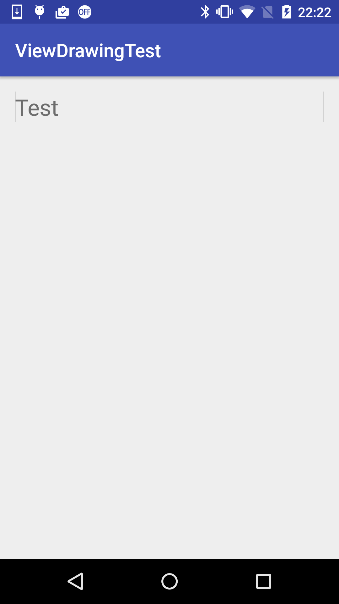
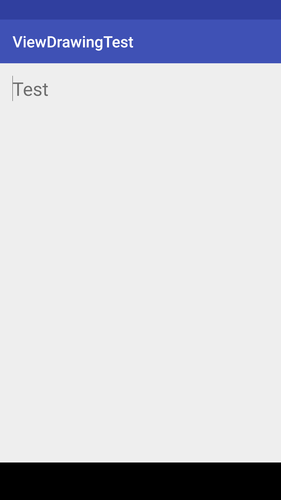

# ViewDrawingTest
Custom view test to draw as expected

How do you test your custom view draw as expected?

This is a sample project for custom view testing.

Using Espresso and Spoon then took screenshots it.

Spoon is great useful but it needs `WRITE_EXTERNAL_STORAGE` permission.

I don't want to add it in product.

Then I add productFlavors `UiTest` and add the permission only in it.

## Usage

1. Change buildVariant to `UiTestDebug`.
1. Run `./gradlew :app:assembleUiTestDebug`
1. Run `./gradlew :app:assembleUiTestDebugAndroidTest`
1. Run `./gradlew :app:spoonUiTestDebugAndroidTest`
1. Then reports are generated in app/build/spoon/UiTest directory.
1. Open index.html with your browser.

## Issue

Screenshots took by spoon are different from on real device.

Here is a sample screenshot by Android Studio.
Lines are drawn both side of TextView.

The same screen took by spoon is here.
Right line was not drawn.

Probably it was a bug on Spoon.
